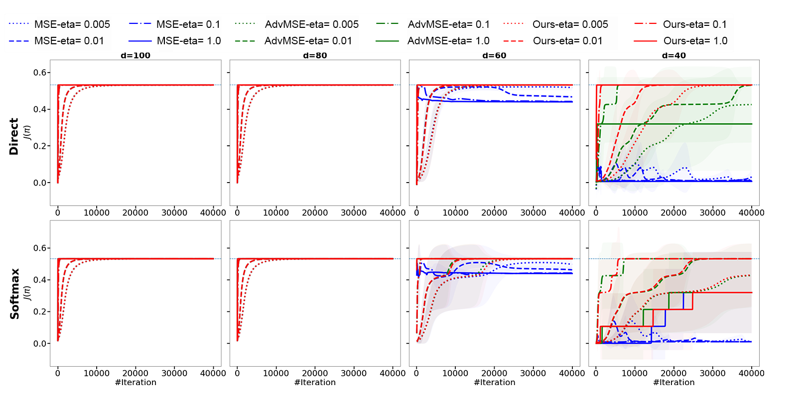

# Decision-Aware Actor Critic

This repository contains implementations of actor-critic algorithms described in the NeurIPS 2023 paper _Decision-Aware Actor-Critic with Function Approximation and Theoretical Guarantees_ (https://arxiv.org/abs/2305.15249) on two grid-world environments. To run the algorithms, please install the required packages and execute the following commands.



## Installation
* Create a virtual environment using python 3.

`virtualenv -p python3 <envname>`

* Activate the virtual environment.

`source envname/bin/activate`

* Clone the repo, and install the necessary python packages with `requirements.txt` file.

`pip install -r requirements.txt`

## Running the code
To execute the algorithms, run `main.py` with the corresponding arguments: 
* You can use methods on two grid-world environments, Cliff World (CW) and Frozen Lake (FL), which you can specify with the `--env` argument.

* You can use three critic loss functions: MSE (squared loss function for Q), AdvMSE (squared loss function for A), and ACPG (decision-aware loss functions), which you can specify with the `--critic_alg` argument.

* You can use two functional representations: direct and softmax, which you can specify with the `--representation` argument.

* You can use two parameterizations for actor policy: linear or tabular, which you can specify with the `--actor_param` argument.

* You can also choose to use the true MDP or sample using Monte Carlo, which you can determine with the `--sampling` argument.

For instance, the following command runs ACPG method on Cliff World environment with a linear actor (d=80) with direct representation, and the agent uses true MDP:
```
python -u main.py \
--env "CW" \
--sampling "MB" \
--critic_alg "ACPG" \
--representation "direct" 
--actor_param "linear" \
--critic_d 80
```

You can also see the configuration parameters here:

## Configuration Parameters
- `--load_config`: Whether to use configured parameters or new parameters. (Default: 0)

- `--env`: Environment selection, choose between Cliff World (CW) or Frozen Lake (FL). (Default: "CW")

- `--sampling`: Sampling method, choose between Monte Carlo (MC), Temporal Difference (TD), or MB (use known MDP). (Default: "MB")

- `--episode_len`: Maximum length of an episode in the sampling. (Default: 20)

- `--num_trajs`: Number of trajectories in sampling. (Default: 1000)

- `--num_iterations`: Number of outer iterations (policy updates). (Default: 40000)

- `--run`: Number of runs. The initialized policy/parameters in the critic and samples are different in each run. (Default: 2)

- `--eta`: Inverse of the parameter for divergence term. (Default: 0.1)

- `--c_in_stepsize`: Whether to use c in step size or not (only use $\eta$) in ACPG actor update. (Default: 0)

- `--c`: Parameter `c` in ACPG algorithm. (Default: 0.1)

- `--representation`: Functional representation, choose between Direct or Softmax. (Default: "direct")

- `--actor_param`: Parameterization type of actor, choose between Tabular or Linear. (Default: "linear")

- `--actor_d`: The capacity/dimension of the actor in linear parameterization. (Default: 80)

- `--actor_num_tiles`: The number of tiles in actor featurization. (Default: 5)

- `--actor_tiling_size`: The size of tiles in actor featurization. (Default: 3)

- `--actor_max_num_iterations`: Actor maximum number of inner loop/off-policy iterations. (Default: 10000)

- `--actor_max_lr`: Actor armijo maximum step size. (Default: 1000)

- `--actor_stop_trs`: Actor threshold on grad norm to break the inner-loop. (Default: 1e-4)

- `--critic_alg`: Type of critic algorithm, choose between MSE, AdvMSE, or ACPG. (Default: "MSE")

- `--critic_d`: The capacity/dimension of the critic. (Default: 80)

- `--critic_num_tiles`: The number of tiles in critic featurization. (Default: 5)

- `--critic_tiling_size`: The size of tiles in critic featurization. (Default: 3)

- `--critic_max_num_iterations`: Critic maximum number of inner iterations. (Default: 10000)

- `--critic_max_lr`: Critic maximum armijo step size. (Default: 1000)

- `--critic_stop_trs`: Critic threshold on grad norm to break the inner-loop. (Default: 1e-6)


